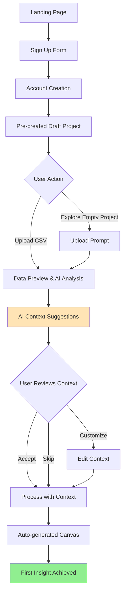
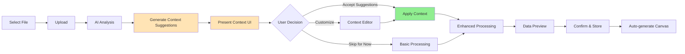
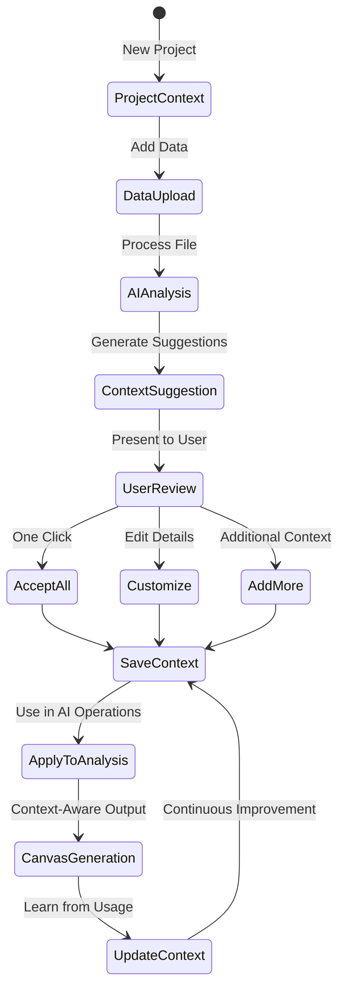
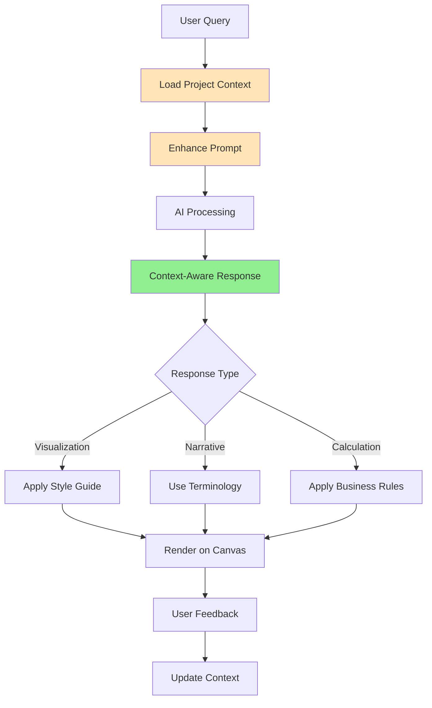

# User Flows & Wireframes

## 1. Overview

This document outlines the key user journeys in Impala, designed to achieve the goal of "first insight in under 60 seconds" while maintaining simplicity for non-technical users. The flows incorporate the critical context feature that enables AI to truly understand each user's business domain and data.

## 2. Core User Journeys

### 2.1. First-Time User Experience (Signup → First Insight)



**Key Design Decisions:**

- No product tour initially - straight to action
- Pre-created draft project eliminates setup friction
- AI suggests context based on data analysis
- Context enhances all subsequent AI operations
- Canvas auto-generates with domain-aware visualizations

**Time Targets:**

- Signup: 30 seconds
- Upload & Processing: 15 seconds
- Context Review: 10 seconds
- First Insight: 5 seconds
- **Total: < 60 seconds**

### 2.2. Data Upload & Context Enhancement Flow



**AI Context Detection Steps:**

1. **Domain Recognition**

   - Industry detection from column names
   - Business model inference
   - Common metric identification

2. **Automatic Suggestions**

   - Metric definitions
   - Relationship mapping
   - Calculation rules
   - Analysis patterns

3. **Smart Defaults**

   - Pre-filled context forms
   - Industry-specific templates
   - Common abbreviations

4. **Learning & Improvement**
   - Track accepted vs modified suggestions
   - Improve domain detection
   - Build organization knowledge base

### 2.3. Context Management Flow



### 2.4. Canvas Creation with Context



## 3. Key Screen Wireframes

### 3.1. Context Suggestion Screen (After Data Upload)

```
┌─────────────────────────────────────────────────────────────────┐
│ 📊 Understanding Your Data                    [Skip] [Customize] │
├─────────────────────────────────────────────────────────────────┤
│                                                                 │
│ Based on your data, here's what we detected:                   │
│                                                                 │
│ ┌─────────────────────────────────────────────────────────────┐│
│ │ 🏢 Industry: E-commerce / Retail                            ││
│ │ 📈 Data Type: Sales Transactions                            ││
│ │ 📅 Time Period: Jan 2023 - Dec 2023                        ││
│ │ 💰 Currency: USD                                            ││
│ └─────────────────────────────────────────────────────────────┘│
│                                                                 │
│ Key Metrics We Identified:                                      │
│ ┌─────────────────────────────────────────────────────────────┐│
│ │ ✓ Revenue = Total sales amount before discounts            ││
│ │ ✓ AOV = Average Order Value (Revenue / Order Count)        ││
│ │ ✓ Customer LTV = Lifetime value per customer               ││
│ │ ✓ CAC = Customer Acquisition Cost                          ││
│ │ + Add custom metric...                                      ││
│ └─────────────────────────────────────────────────────────────┘│
│                                                                 │
│ Suggested Analysis Focus:                                       │
│ ┌─────────────────────────────────────────────────────────────┐│
│ │ • Year-over-year growth comparisons                        ││
│ │ • Seasonal patterns (Q4 holiday spike expected)            ││
│ │ • Customer segment performance                             ││
│ │ • Product category analysis                                ││
│ └─────────────────────────────────────────────────────────────┘│
│                                                                 │
│ How should we communicate insights?                             │
│ ┌─────────────────────────────────────────────────────────────┐│
│ │ Style: [Executive Summary ▼]                               ││
│ │ Terminology: Use "Customers" not "Users"                   ││
│ │ Focus: Revenue growth and profitability                    ││
│ └─────────────────────────────────────────────────────────────┘│
│                                                                 │
│              [Accept All Suggestions]  [Customize Details]      │
└─────────────────────────────────────────────────────────────────┘
```

### 3.2. Context Editor (Detailed View)

```
┌─────────────────────────────────────────────────────────────────┐
│ 📝 Project Context Editor                    [Save] [Cancel]    │
├─────────────────────────────────────────────────────────────────┤
│                                                                 │
│ ┌─────────────────────┬─────────────────────────────────────┐  │
│ │ Context Categories  │  Business Context                   │  │
│ │                     │  ┌─────────────────────────────────┐│  │
│ │ ▶ Business Context  │  │ Industry: [E-commerce      ▼] ││  │
│ │ ▼ Metrics & KPIs    │  │                               ││  │
│ │ ▶ Relationships     │  │ Description:                  ││  │
│ │ ▶ Analysis Rules    │  │ ┌─────────────────────────────┐││  │
│ │ ▶ Communication     │  │ │ We're an online retailer   │││  │
│ │ ▶ Custom Rules      │  │ │ focused on sustainable     │││  │
│ │                     │  │ │ fashion. Primary markets:  │││  │
│ │                     │  │ │ US, UK, and EU.           │││  │
│ │                     │  │ └─────────────────────────────┘││  │
│ │                     │  │                               ││  │
│ │                     │  │ Key Business Drivers:         ││  │
│ │                     │  │ • Customer retention          ││  │
│ │                     │  │ • Average order value         ││  │
│ │                     │  │ • Conversion rate             ││  │
│ │                     │  │ [+ Add driver]                ││  │
│ └─────────────────────┴─────────────────────────────────────┘  │
│                                                                 │
│ Metrics & KPIs                                                  │
│ ┌─────────────────────────────────────────────────────────────┐│
│ │ Metric Name    │ Definition              │ How to Calculate ││
│ ├────────────────┼─────────────────────────┼──────────────────┤│
│ │ Revenue        │ Total sales before tax  │ SUM(order_total) ││
│ │ AOV            │ Average order value     │ Revenue/Orders   ││
│ │ LTV            │ Customer lifetime value │ AOV × Frequency  ││
│ │ [+ Add metric] │                         │                  ││
│ └─────────────────────────────────────────────────────────────┘│
└─────────────────────────────────────────────────────────────────┘
```

### 3.3. Enhanced Canvas with Context-Aware AI

```
┌─────────────────────────────────────────────────────────────────┐
│ Canvas: Sales Analysis Q1 2024    [👁 View] [↗ Share] [🧠]     │
├─────────────────────────────────────────────────────────────────┤
│ Context Active: E-commerce Retail | Focus: Growth & Retention  │
├─────────────────────────────────────────────────────────────────┤
│ ┌─────────────────────────────────────────────────────────────┐│
│ │ 💬 "Show me customer acquisition performance"           [↵] ││
│ │                                                             ││
│ │ 🧠 Using context: CAC definition, LTV calculations,        ││
│ │    cohort analysis preferences                             ││
│ └─────────────────────────────────────────────────────────────┘│
│                                                                 │
│ ┌─────────────────────────┬─────────────────────────────────┐  │
│ │ # Customer Acquisition  │ 📊 CAC vs LTV by Channel       │  │
│ │   Performance Q1 2024   │                                 │  │
│ │                         │ [Chart showing CAC:LTV ratios] │  │
│ │ ## Executive Summary    │                                 │  │
│ │                         │ Healthy ratio threshold: 1:3    │  │
│ │ Customer acquisition    │ ✅ Organic: 1:4.2              │  │
│ │ efficiency improved 23% │ ✅ Email: 1:3.8                │  │
│ │ QoQ, with organic       │ ⚠️  Paid Social: 1:2.1         │  │
│ │ channels showing the    │ ❌ Display Ads: 1:1.4          │  │
│ │ strongest LTV:CAC ratio │                                 │  │
│ │ at 4.2:1               │ 🔍 Click for cohort details    │  │
│ │                         │                                 │  │
│ │ Key Insights:           │                                 │  │
│ │ • Organic traffic shows │                                 │  │
│ │   highest profitability │                                 │  │
│ │ • Display ads are below │                                 │  │
│ │   break-even threshold  │                                 │  │
│ └─────────────────────────┴─────────────────────────────────┘  │
└─────────────────────────────────────────────────────────────────┘
```

### 3.4. Context Quick Access Panel

```
┌─────────────────────────────────────────────────────────────────┐
│ 🧠 Active Context                                    [Edit] [×] │
├─────────────────────────────────────────────────────────────────┤
│                                                                 │
│ Industry: E-commerce Retail                                     │
│ Focus: Customer Growth & Retention                              │
│                                                                 │
│ Key Metrics:                                                    │
│ • Revenue → Total sales before discounts                       │
│ • CAC → Customer Acquisition Cost                              │
│ • LTV → Lifetime Value (AOV × Purchase Frequency × Lifespan)   │
│                                                                 │
│ Active Rules:                                                   │
│ • Always compare metrics YoY                                   │
│ • Flag CAC:LTV ratios below 1:3                               │
│ • Highlight seasonal patterns                                  │
│                                                                 │
│ Communication:                                                  │
│ • Executive summary style                                       │
│ • Use "customers" not "users"                                  │
│ • Focus on actionable insights                                 │
│                                                                 │
│ [View Full Context] [Add Rule] [Reset to Defaults]             │
└─────────────────────────────────────────────────────────────────┘
```

### 3.5. Project Dashboard with Context

```
┌─────────────────────────────────────────────────────────────────┐
│ [≡] Impala                                    [🔔] [?] [Profile] │
├─────────────────────────────────────────────────────────────────┤
│                                                                 │
│ ┌─────────────┐  ┌─────────────────────────────────────────┐  │
│ │ NAVIGATION  │  │  My E-commerce Project                   │  │
│ │             │  │  🧠 Context: Retail Analytics            │  │
│ │ Projects    │  │                                           │  │
│ │ > Project 1 │  │  ┌────────────────────────────────────┐  │  │
│ │   Project 2 │  │  │ Project Understanding:             │  │  │
│ │   + New     │  │  │                                    │  │  │
│ │             │  │  │ ✓ Industry context configured     │  │  │
│ │ Data Sources│  │  │ ✓ 15 metrics defined              │  │  │
│ │ > Sales.csv │  │  │ ✓ 8 analysis rules active         │  │  │
│ │   Orders.csv│  │  │                                    │  │  │
│ │   + Add     │  │  │ [Manage Context] [View Rules]     │  │  │
│ │             │  │  └────────────────────────────────────┘  │  │
│ │ Canvases    │  │                                           │  │
│ │ > Q1 Report │  │  Recent Context Updates:                  │  │
│ │   Monthly   │  │  • Added "ROAS" metric definition         │  │
│ │   + New     │  │  • Updated CAC calculation formula        │  │
│ │             │  │  • Set quarterly comparison as default    │  │
│ │ Context     │  │                                           │  │
│ │ > Settings  │  │  Quick Actions:                           │  │
│ └─────────────┘  │  [📊 New Canvas] [📁 Add Data] [🧠 Context]│  │
│                  └─────────────────────────────────────────┘  │
└─────────────────────────────────────────────────────────────────┘
```

### 3.6. Context Learning Interface

```
┌─────────────────────────────────────────────────────────────────┐
│ 🧠 Context Learning                          [Apply] [Dismiss] │
├─────────────────────────────────────────────────────────────────┤
│                                                                 │
│ Based on your recent analyses, we noticed:                     │
│                                                                 │
│ ┌─────────────────────────────────────────────────────────────┐│
│ │ 📊 You frequently calculate "Repeat Purchase Rate"          ││
│ │    Suggested definition:                                    ││
│ │    "Customers with 2+ orders / Total Customers"            ││
│ │                                                             ││
│ │    [✓ Add to metrics] [Modify] [Ignore]                    ││
│ └─────────────────────────────────────────────────────────────┘│
│                                                                 │
│ ┌─────────────────────────────────────────────────────────────┐│
│ │ 🔍 You often filter by "Premium Customers"                  ││
│ │    Create a saved segment?                                  ││
│ │    Definition: LTV > $500 AND Orders > 3                   ││
│ │                                                             ││
│ │    [✓ Save segment] [Adjust] [Not now]                     ││
│ └─────────────────────────────────────────────────────────────┘│
│                                                                 │
│ ┌─────────────────────────────────────────────────────────────┐│
│ │ 📝 Your narratives consistently mention "sustainability"    ││
│ │    Add to communication preferences?                        ││
│ │                                                             ││
│ │    [✓ Yes, emphasize this] [No thanks]                     ││
│ └─────────────────────────────────────────────────────────────┘│
└─────────────────────────────────────────────────────────────────┘
```

## 4. Context Feature Interaction Patterns

### 4.1. Progressive Context Building

1. **Initial Upload**: Basic suggestions based on data structure
2. **First Analysis**: Learn from user corrections
3. **Ongoing Usage**: Refine and expand context
4. **Maturity**: Highly customized domain understanding

### 4.2. Context Inheritance Hierarchy

```
Organization Context (future)
    ↓ (inherits)
User Context (future)
    ↓ (inherits)
Project Context (MVP)
    ↓ (applies to)
Individual Analyses
```

### 4.3. Context Override Capabilities

- Temporary overrides for specific analyses
- A/B testing different context settings
- Context versioning and rollback
- Context templates for common scenarios

## 5. Mobile Context Experience

### 5.1. Simplified Context View

- Collapsible context summary
- Key metrics always visible
- Quick context switching
- Voice input for context additions

### 5.2. Context-Aware Mobile Queries

```
┌─────────────────────────────────────────┐
│ 📱 Mobile Canvas                        │
├─────────────────────────────────────────┤
│ 🧠 Retail Context Active               │
│                                         │
│ [🎤] "Show me today's sales"           │
│                                         │
│ Understanding: Daily revenue,           │
│ compared to average, filtered by        │
│ your defined business hours...          │
│                                         │
│ [Chart displays here]                   │
└─────────────────────────────────────────┘
```

## 6. Error States & Edge Cases with Context

### 6.1. Conflicting Context Rules

```
┌─────────────────────────────────────────────────────────────────┐
│ ⚠️ Context Conflict Detected                                   │
├─────────────────────────────────────────────────────────────────┤
│                                                                 │
│ Your context rules have conflicting definitions:               │
│                                                                 │
│ Rule 1: "Revenue includes tax"                                 │
│ Rule 2: "Revenue is pre-tax amount"                           │
│                                                                 │
│ Which should we use?                                           │
│ [Use Rule 1] [Use Rule 2] [Edit Context] [Ask me each time]    │
└─────────────────────────────────────────────────────────────────┘
```

### 6.2. Missing Context Warning

```
┌─────────────────────────────────────────────────────────────────┐
│ 💡 Enhance Your Analysis                                        │
├─────────────────────────────────────────────────────────────────┤
│                                                                 │
│ Adding context about your business will help us:               │
│ • Generate more relevant insights                              │
│ • Use your preferred terminology                               │
│ • Apply your business rules automatically                      │
│                                                                 │
│ [Add Context Now] [Remind Me Later] [Continue Without]         │
└─────────────────────────────────────────────────────────────────┘
```

## 7. Implementation Priorities with Context

### Phase 1 (MVP) - Project-Level Context

1. Context suggestion on upload
2. Basic context editor
3. Context application in AI queries
4. Simple metric definitions

### Phase 2 - Enhanced Context

1. Context learning from usage
2. Context templates
3. Advanced relationship mapping
4. Context versioning

### Phase 3 - Multi-Level Context

1. User-level preferences
2. Organization standards
3. Context sharing marketplace
4. Industry-specific templates

## 8. Success Metrics for Context Feature

1. **Context Adoption Rate**: % of projects with defined context
2. **Context Accuracy**: % of accepted vs modified suggestions
3. **Query Relevance**: Improvement in first-query success rate
4. **Time to Insight**: Reduction when context is active
5. **User Satisfaction**: Ratings for AI understanding

## 9. Context Feature Benefits

### For Users:

- No need to explain basics repeatedly
- Consistent terminology across analyses
- Faster, more accurate insights
- Reduced errors in calculations

### For AI:

- Better understanding of user intent
- More accurate query generation
- Contextual response formatting
- Domain-specific recommendations

### For Organization:

- Standardized metrics across teams
- Preserved institutional knowledge
- Onboarding acceleration for new users
- Competitive advantage through customization
